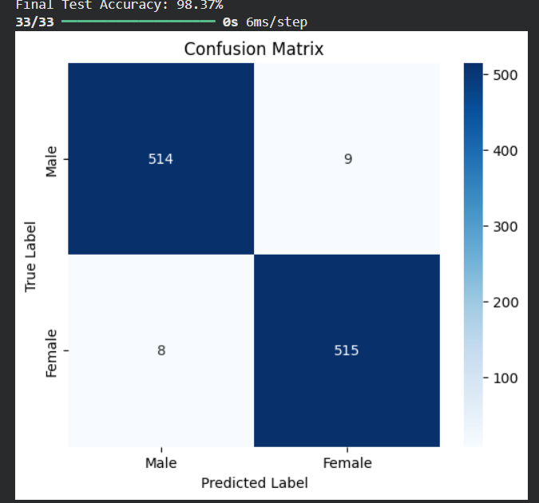
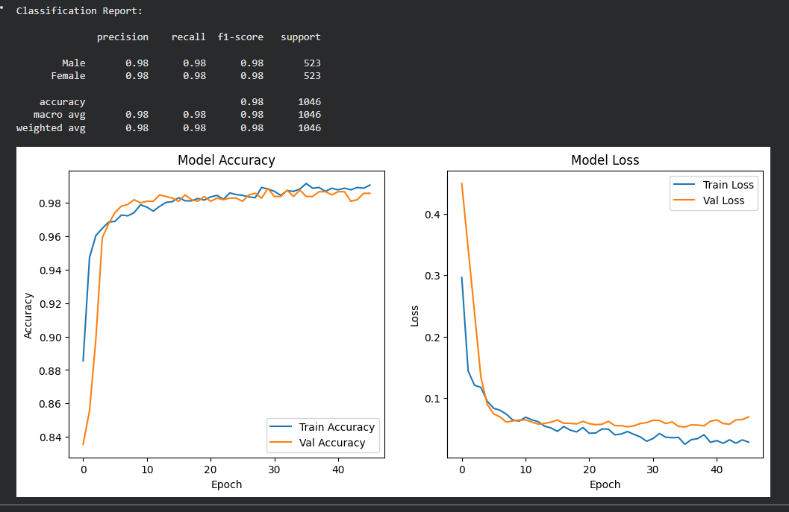

# CNN Voice Gender Classification

> A 1D Convolutional Neural Network that classifies audio recordings as male or female — achieving **97% accuracy** on the test set.

---

## Overview

Audio classification using deep learning. The model takes voice feature data, processes it through a 1D CNN, and classifies the speaker's gender with high confidence. Built and evaluated end-to-end independently — data preprocessing, model design, training, and full performance analysis.

---

## Results




| Metric | Value |
|---|---|
| Test Accuracy | **97%** |
| Model Type | 1D Convolutional Neural Network (CNN) |
| Dataset | [Voice Gender Dataset (Kaggle)](https://www.kaggle.com/datasets/primaryobjects/voicegender) |

---

## How It Works

```
Voice Feature Data (voice.csv)
        ↓
  Train/Test Split (stratified, before scaling)
        ↓
  Feature Scaling (StandardScaler, fit on train only)
        ↓
  1D CNN Classifier
        ↓
  Prediction: Male / Female + Confidence Score
```

**Why split before scaling?**
A common mistake is fitting the scaler on the full dataset before splitting, which leaks information from the test set into training. This implementation splits first and fits the scaler only on training data — simulating real-world conditions where test data is genuinely unseen.

---

## Model Architecture

Two convolutional blocks with increasing filter depth, followed by a dense classifier head:

- **Block 1** — 64 filters, kernel size 3, BatchNormalization, MaxPooling, Dropout (0.3)
- **Block 2** — 128 filters, kernel size 3, BatchNormalization, MaxPooling, Dropout (0.3)
- **Classifier head** — Flatten → Dense(64, relu) → Dropout(0.3) → Dense(1, sigmoid)

Training uses early stopping on validation loss with best-weight restoration to prevent overfitting.

---

## Tech Stack

| Layer | Tools |
|---|---|
| Language | Python |
| Deep Learning | TensorFlow / Keras |
| Data Handling | NumPy, Pandas, Scikit-learn |
| Visualisation | Matplotlib, Seaborn |
| Development | VS Code, Claude Code CLI |

---

## Project Structure

```
cnn-voice-gender-classification/
├── neural_project.py         # Full training & evaluation pipeline
├── requirements.txt          # Python dependencies
├── voice.csv                 # Dataset (not included — download separately)
├── confusion_matrix.png      # Generated after running the script
├── training_history.png      # Generated after running the script
└── README.md
```

---

## Setup & Run

```bash
# Clone the repo
git clone https://github.com/IslamMabdo/cnn-voice-gender-classification
cd cnn-voice-gender-classification

# Install dependencies
pip install -r requirements.txt

# Download voice.csv from Kaggle and place it in this folder
# https://www.kaggle.com/datasets/primaryobjects/voicegender

# Run the full pipeline
python neural_project.py
```

The script trains the model, evaluates it on the test set, and saves both the confusion matrix and training history plots to disk.

---

## Detailed Metrics

The script outputs a full breakdown beyond accuracy:

- Sensitivity (ability to detect Female)
- Specificity (ability to detect Male)
- Full classification report (precision, recall, F1-score per class)
- Confusion matrix breakdown (TP, TN, FP, FN)

---

## Key Challenges

- **Data leakage prevention** — splitting before scaling and fitting the scaler only on training data, a step that's easy to overlook.
- **Overfitting control** — addressed with Dropout layers, BatchNormalization, and early stopping based on validation loss.
- **Architecture tuning** — chose increasing filter depth (64 → 128) to let the network learn low-level then higher-level feature combinations.

---

## Related Projects


---

*Computer & Software Engineering — [MUST], 2025*
